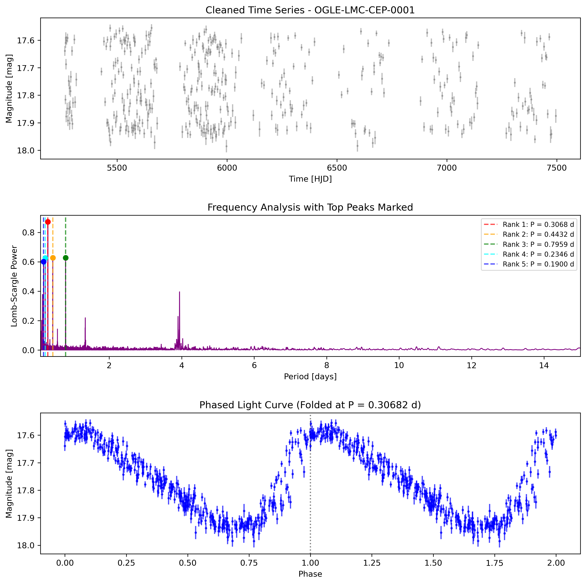
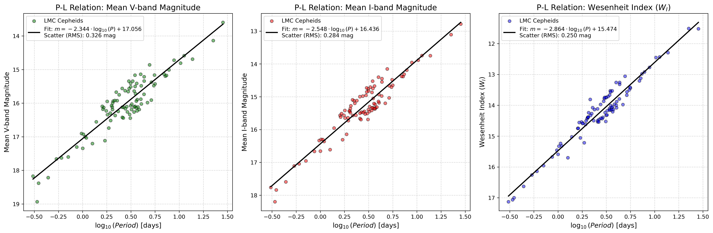

# CepheidsPipeline: Multi-Band Photometric Analysis & P-L Relation

An automated, modular Python pipeline for processing astronomical time-series data of Classical Cepheids. This tool extracts raw photometric measurements, performs digital signal processing to determine pulsation periods, and constructs empirical Period-Luminosity (Leavitt Law) relations across multiple photometric filters (V, I) and reddening-free Wesenheit indices.

## Data Source: The OGLE Survey
The pipeline fetches raw photometry of Cepheids in the Large Magellanic Cloud (LMC) sourced from the **Optical Gravitational Lensing Experiment (OGLE-IV)**, operated by the University of Warsaw.

## Key Features 
* **Automated Data Ingestion:** Dynamically downloads raw `.dat` light curves from OGLE servers.
* **Robust Noise Reduction:** Applies iterative sigma-clipping to remove atmospheric and instrumental outliers.
* **Lomb-Scargle Periodogram:** Utilizes `astropy` to extract the primary pulsation frequency from unevenly sampled astronomical data, accurately bypassing daily observation aliases.
* **Batch Population Analysis:** Processes hundreds of stars sequentially to map population-level astrophysical relations.

## Quick Start

### 1. Installation
```bash
git clone [https://github.com/JanskyContinuum/CepheidsPipeline.git](https://github.com/JanskyContinuum/CepheidsPipeline.git)
cd CepheidsPipeline
pip install -r requirements.txt
```

### 2. Single Star Analysis
To run the pipeline for a single star and generate a diagnostic multi-panel plot (raw data, periodogram, and phase-folded light curve):
```bash
python scripts/analyze_cepheid.py 1
```
(This analyzes OGLE-LMC-CEP-0001. You can replace 1 with any catalog number).

### 3. Batch Processing (Period-Luminosity Relation)
To process a sample of Cepheids in V and I bands, calculate Wesenheit indices, and generate the regression analysis:
```bash
python scripts/build_pl_relation.py
```

## 📈 Results & Interpretation
The pipeline generates analytical plots and CSV datasets, automatically saved in the results/ directory. You can view sample outputs in the results/examples/ folder.

### 1. Phase-Folded Light Curves
The single-star analysis collapses years of chaotic, irregularly sampled observations into a clean, normalized pulsation phase [0.0, 2.0], revealing the true physical waveform (e.g., the characteristic asymmetrical "shark fin" of fundamental mode Cepheids).

<p align="center">
  
  <br>
  <em>Light Curve of OGLE-LMC-CEP-0001</em>
</p>

### 2. Multi-Band Period-Luminosity Relation & Wesenheit Index

When running the batch analysis (`build_pl_relation.py`), the pipeline outputs a 3-panel scatter plot comparing the Period-Luminosity (Leavitt Law) relation across the V band, I band, and the reddening-free Wesenheit Index ($W_I$).

<p align="center">
  
  <br>
  <em>Comparison of the Leavitt Law across V, I, and Wesenheit indices, showing the progressive reduction in statistical scatter.</em>
</p>

The multi-band regression fits and scatter values captured by the pipeline are:
* **V-band:** $m = -2.344 \cdot \log_{10}(P) + 17.056$ (Scatter RMS: $0.326\text{ mag}$)
* **I-band:** $m = -2.548 \cdot \log_{10}(P) + 16.436$ (Scatter RMS: $0.284\text{ mag}$)
* **Wesenheit Index ($W_I$):** $m = -2.864 \cdot \log_{10}(P) + 15.474$ (Scatter RMS: $0.250\text{ mag}$)

As demonstrated by the decreasing RMS scatter values, moving from the optical V-band to the I-band, and finally to the extinction-corrected Wesenheit index $W_I$, significantly tightens the relations.
