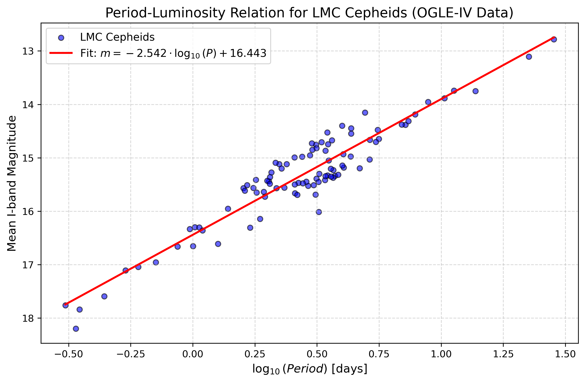

# CepheidsPipeline: Photometric Analysis & P-L Relation

An automated, end-to-end Python pipeline for processing astronomical time-series data of Classical Cepheids. This tool extracts raw photometric measurements, performs digital signal processing to determine pulsation periods, and dynamically constructs the empirical Period-Luminosity (Leavitt Law) relation.

## Data Source: The OGLE Survey
The pipeline fetches raw I-band photometry of Cepheids in the Large Magellanic Cloud (LMC). The data is sourced directly from the public archive of the **Optical Gravitational Lensing Experiment (OGLE-IV)**, a world-leading sky survey operated by the University of Warsaw. 

## Key Features & Physics
* **Automated Data Ingestion:** Dynamically downloads raw `.dat` light curves from OGLE servers.
* **Robust Noise Reduction:** Applies iterative sigma-clipping to remove atmospheric and instrumental outliers.
* **Lomb-Scargle Periodogram:** Utilizes `astropy` to extract the primary pulsation frequency from unevenly sampled astronomical data, accurately bypassing daily observation aliases.
* **Batch Population Analysis:** Processes hundreds of stars sequentially to map population-level astrophysical relations.

---

## Quick Start

### 1. Installation
Clone the repository and install the required dependencies:
```bash
git clone [https://github.com/JanskyContinuum/CepheidsPipeline.git](https://github.com/JanskyContinuum/CepheidsPipeline.git)
cd CepheidsPipeline
pip install numpy astropy scipy pandas matplotlib
```

### 2. Single Star Analysis
To run the pipeline for a single star and generate a diagnostic multi-panel plot (raw data, periodogram, and phase-folded light curve):Bashpython scripts/analyze_cepheid.py 1
(This analyzes OGLE-LMC-CEP-0001. You can replace 1 with any catalog number).

### 3. Batch Processing (Period-Luminosity Relation)
To process a large sample of Cepheids and generate the Leavitt Law regression:
```bash
python scripts/build_pl_relation.py
```
## Results & Interpretation
The pipeline generates analytical plots and CSV datasets, automatically saved in the results/ directory. You can view sample outputs in the results/examples/ folder.

### 1. Phase-Folded Light Curves
The single-star analysis collapses years of chaotic, irregularly sampled observations into a clean, normalized pulsation phase [0.0, 2.0], revealing the true physical waveform (e.g., the characteristic asymmetrical "shark fin" of fundamental mode Cepheids).

<p align="center">
  
  <br>
  <em>Light Curve of OGLE-LMC-CEP-0001</em>
</p>

### 2. The Period-Luminosity Relation & Pulsation Modes
When running the batch analysis (build_pl_relation.py), the pipeline outputs a scatter plot of $\log_{10}(P)$ vs. Mean Magnitude.

<p align="center">
  
  <br>
  <em>Period-Luminosity relation (Leavitt Law) for a sample of LMC Cepheids. The linear regression fit is shown in red. </em>
 </p>

The resulting regression plot clearly demonstrates two distinct, parallel bands of stars. This is not a data error, but a physical reality successfully captured by the pipeline.
The Lower Band (Fainter): Stars pulsating in the Fundamental Mode.
The Upper Band (Brighter): Stars pulsating in the First Overtone. 
